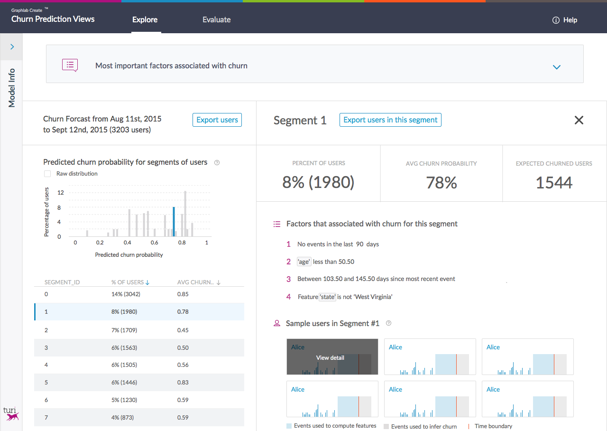
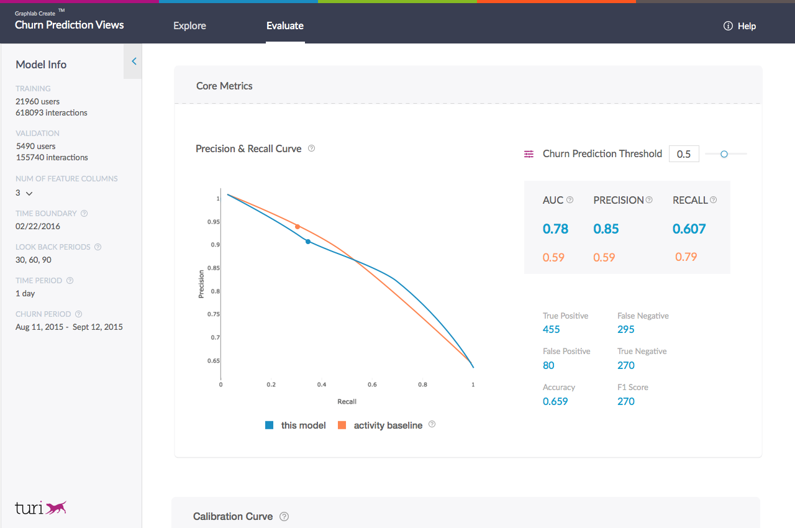

<script src="../turi/js/recview.js"></script>
# Using a trained churn predictor model

In this chapter, we will explore how to use a trained churn predictor model.
This includes the following:
- [Making a churn forecast](#making-a-forecast)
- [Evaluating the model](#evaluating-a-model)
- [Generating a churn report](#making-a-churn-report)
- [Explaining the predictions](#explaining-predictions)
- [Accessing the model & underlying features](#accessing-a-model)
- [Visualizing the model](#visualizing-a-model)
- [Saving & loading the model](#saving-a-model)

#### <a name="making-a-forecast"></a> Making predictions (a churn forecast)

The goal of a churn prediction model is to predict the probability that a user
has no activity for a `churn_period` of time in the future. Hence, the output
of this model is a forecast of what might happen **in the future**. The
following example illustrates this concept.

```python
predictions = model.predict(time_series)
```

```no-highlight
+------------+-----------------+
| CustomerID |   probability   |
+------------+-----------------+
|    None    | 0.0661627277732 |
|   12346    |  0.67390537262  |
|   12347    |  0.760785758495 |
|   12348    |  0.62475168705  |
|   12349    |  0.372504591942 |
|   12350    |  0.67390537262  |
|   12352    |  0.201043695211 |
|   12353    |  0.821378648281 |
|   12354    |  0.737500548363 |
|   12355    |  0.699232280254 |
+------------+-----------------+
[4340 rows x 2 columns]
```

Note that you can also set a specific time at which the predictions must be
made.  

```python
prediction_time = datetime.datetime(2011, 9, 1)
predictions = model.predict(time_series, time_boundary = prediction_time)
```

```no-highlight
+------------+-----------------+
| CustomerID |   probability   |
+------------+-----------------+
|    None    | 0.0358778424561 |
|   12346    |  0.884932994843 |
|   12347    |  0.488953769207 |
|   12348    |  0.861040890217 |
|   12350    |  0.871586084366 |
|   12352    |  0.852140307426 |
|   12353    |  0.778547585011 |
|   12354    |  0.83321160078  |
|   12355    |  0.826072216034 |
|   12356    |  0.815514743328 |
+------------+-----------------+
[4373 rows x 2 columns]
```

During predictions, you may get a message that says `Not enough data to make
predictions for 1005 user(s)`. There could be several reasons why predictions
cannot be made for a set of users, they are:
- The user did not have any activity **before** the prediction time.
- The user did not have any activity for a period of time used during the
  feature engineering process (controlled by the parameter `lookback_periods`).
  The model looks at the usage history in the recent past to make a forecast.
  If no activity was present during this recent past, then predictions cannot
  be made. A prediction of `None` is returned in this case.


#### <a name="evaluating-a-model"></a> Evaluating a model

The
[random_split](https://turi.com/products/create/docs/generated/graphlab.churn_predictor.ChurnPredictor.predict.html#graphlab.churn_predictor.random_split)
function provides a safe way to split the `observation_data` into a train and
validation split specially for the task of churn prediction. The recommended
way to evaluate a churn prediction model is to first simulate what the model
would have predicted at a `time_boundary` in the past and compare those
predictions with the ground truth obtained from events after the
`time_boundary`. This can be done as follows:

```python
eval_time = datetime.datetime(2011, 10, 1)
metrics = model.evaluate(valid, time_boundary = eval_time)
```

```no-highlight
{
'auc'      : 0.6634142545907242,
'recall'   : 0.6243386243386243,
'precision': 0.6310160427807486,
'evaluation_data':
         +------------+-----------------+-------+
         | CustomerID |   probability   | label |
         +------------+-----------------+-------+
         |   12348    |  0.93458378315  |   1   |
         |   12361    |  0.437742382288 |   1   |
         |   12365    |       0.5       |   1   |
         |   12375    |  0.769197463989 |   0   |
         |   12380    |  0.339888572693 |   0   |
         |   12418    |  0.15767210722  |   1   |
         |   12432    |  0.419652849436 |   0   |
         |   12434    |  0.88883471489  |   1   |
         |   12520    | 0.0719764530659 |   1   |
         |   12546    |  0.949095606804 |   0   |
         +------------+-----------------+-------+
         [359 rows x 3 columns]
'roc_curve':
        +-----------+-----+-----+-----+-----+
        | threshold | fpr | tpr |  p  |  n  |
        +-----------+-----+-----+-----+-----+
        |    0.0    | 1.0 | 1.0 | 189 | 170 |
        |   1e-05   | 1.0 | 1.0 | 189 | 170 |
        |   2e-05   | 1.0 | 1.0 | 189 | 170 |
        |   3e-05   | 1.0 | 1.0 | 189 | 170 |
        |   4e-05   | 1.0 | 1.0 | 189 | 170 |
        |   5e-05   | 1.0 | 1.0 | 189 | 170 |
        |   6e-05   | 1.0 | 1.0 | 189 | 170 |
        |   7e-05   | 1.0 | 1.0 | 189 | 170 |
        |   8e-05   | 1.0 | 1.0 | 189 | 170 |
        |   9e-05   | 1.0 | 1.0 | 189 | 170 |
        +-----------+-----+-----+-----+-----+
        [100001 rows x 5 columns]
'precision_recall_curve':
         +---------+----------------+----------------+
         | cutoffs |   precision    |     recall     |
         +---------+----------------+----------------+
         |   0.1   | 0.568181818182 | 0.925925925926 |
         |   0.25  |  0.6138996139  | 0.84126984127  |
         |   0.5   | 0.631016042781 | 0.624338624339 |
         |   0.75  | 0.741935483871 | 0.243386243386 |
         |   0.9   | 0.533333333333 | 0.042328042328 |
         +---------+----------------+----------------+
         [5 rows x 3 columns]
}
```

#### <a name="accessing-a-model"></a> Accessing the underlying features & model

After a churn prediction model is trained, one can access the underlying
features and boosted tree model that are being used:

```python
# Get the trained boosted trees model.
bt_model = model.trained_model

# Get the training data after feature engineering.
train_data = model.processed_training_data
```
#### <a name="explaining-a-model"></a> Explaining predictions

In addition to model predictions, one can also obtain explanations about why
the model made a specific prediction. This can be obtained with the
[explain](https://turi.com/products/create/docs/generated/graphlab.churn_predictor.ChurnPredictor.explain.html#graphlab.churn_predictor.ChurnPredictor.explain)
method whose API is very similar to the [predict
](https://turi.com/products/create/docs/generated/graphlab.churn_predictor.ChurnPredictor.predict.html#graphlab.churn_predictor.ChurnPredictor.predict)
method.

```python
eval_time = datetime.datetime(2011, 10, 1)
explanation = model.explain(valid, time_boundary = eval_time)
print explanation['explanation'][0]
```
```
['Less than 6.50 days since the first event in the last 90 days',
 'Sum of "Quantity" in the last 90 days more than (or equal to) 200.50',
 'Less than 2.50 days between the first two events in the last 90 days',
 'Sum of "Quantity" in the last 21 days less than 547.00',
 'More than (or equal to) 1.50 "min" events in feature "Quantity" each day in the last 90 days',
 'Less than 111.00 "sum" events in feature "Quantity" in the last 60 day']
```

These are explanations that are specific to each user. The `get_feature_importance`
function can provide an overview of the set of features that are important to
this model while making predictions.  

```python
print model.get_feature_importance()
```
```
+------------------------+--------------------+-------+-------------------------------+
|          name          |       index        | count |          description          |
+------------------------+--------------------+-------+-------------------------------+
| Quantity||features||7  | user_timesinceseen |   99  |  Days since most recent event |
| Quantity||features||90 |      sum||sum      |   43  | Sum of "Quantity" in the l... |
| Quantity||features||90 |      sum||max      |   20  | Max of "Quantity" in the l... |
| Quantity||features||60 |      sum||min      |   20  | Sum of "Quantity" is  each... |
| Quantity||features||60 |      sum||sum      |   20  | Sum of "Quantity" in the l... |
| Quantity||features||60 |     count||sum     |   17  | "sum" events in feature "Q... |
| Quantity||features||90 |     sum||count     |   17  | Days with an event in the ... |
| Quantity||features||60 |    count||ratio    |   16  | Average number of "ratio" ... |
| Quantity||features||90 |     count||sum     |   16  | "sum" events in feature "Q... |
| Quantity||features||90 |      sum||min      |   16  | Sum of "Quantity" is  each... |
+------------------------+--------------------+-------+-------------------------------+
```

#### <a name="making-a-churn-report"></a> Making a churn report

In addition to predictions and explanations, one can also get a detailed churn
report which clusters the users into segments and then provides a reason for
churn for users in the segment.

```python
report = model.get_churn_report(valid)
```
The output of the churn report is an SFrame which segments users that have a
similar churn probability and reason for churn.  

#### <a name="visualizing-a-model"></a> Visualizations

Once a model has been trained, you can easily visualize the model. There are
three built-in visualizations to help explore, explain, and evaluate the model:
- **Explore**: This view helps explore the predictions (and associated
  explanations) made by the model as generated by the churn report.
- **Evaluate**: This view helps quickly provide all the information needed to
  determine if the model compares well with a simple activity based baseline.
- **Overview**: This view combines the explore and evaluate views into a tabbed
  view.

The explore view can be obtained as follows:
```python
time_boundary = datetime.datetime(2011, 10, 1)
view = model.views.explore(train, time_boundary)
view.show()
```


The evaluate view creates a visualization that compares the model to a
baseline.  The default baseline is an activity based model that uses **only**
the time duration of in-activity to predict churn.
```python
time_boundary = datetime.datetime(2011, 10, 1)
view = model.views.evaluate(train, time_boundary)
view.show()
```


The **overview** is a tabbed view that combines the explore and evaluate.

```python
time_boundary = datetime.datetime(2011, 10, 1)
view = model.views.overview(train, time_boundary)
view.show()
```

#### <a name="saving-a-model"></a> Saving and loading a model

The model can be saved for later use, either on the local machine or in an AWS
S3 bucket.  The saved model sits in its own directory, and can be loaded back
in later to make more predictions.


```python
# Save the model for later use
model.save("my_model")

# Load the model!
model = graphlab.load_model("my_model")
```
