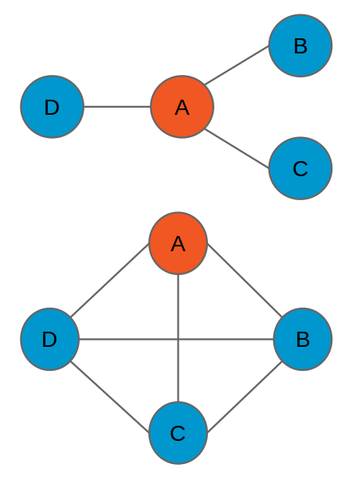
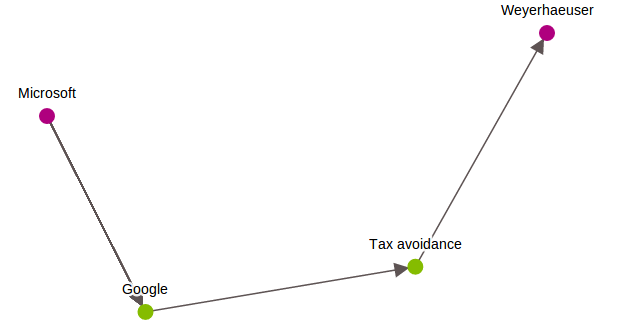

<script src="../dato/js/recview.js"></script>

#Examples
To illustrate some of these methods, we'll use a previously created SGraph where
vertices represent Wikipedia articles about US businesses and edges represent
hyperlinks between articles. This data is available under the Creative Commons
Attribution-ShareAlike 3.0 Unported License (more details here:
[http://en.wikipedia.org/wiki/Wikipedia:Copyrights](http://en.wikipedia.org/wiki/Wikipedia:Copyrights)).
It can be downloaded from Dato's public datasets bucket on Amazon S3. The
remaining methods are left for the reader to explore in the exercises at the end
of the chapter.

```python
import os

data_file = 'US_business_links'
if os.path.exists(data_file):
    sg = graphlab.load_sgraph(data_file)
else:
    url = 'http://s3.amazonaws.com/dato-datasets/' + data_file
    sg = graphlab.load_sgraph(url)
    sg.save(data_file)

print sg.summary()
```
```no-highlight
{'num_edges': 517127, 'num_vertices': 233121}
```


##### PageRank

PageRank is an iterative algorithm to compute the most influential nodes in a
network. In each iteration, a vertex's influence is measured as the sum of
influence of the nodes that point at the vertex. Each node's score is updated
until the scores converge, or until the user-specified maximum number of
iterations is reached.


*"PageRank-hi-res". Licensed under Creative Commons Attribution-Share Alike 2.5 via Wikimedia Commons - http://commons.wikimedia.org/wiki/File:PageRank-hi-res.png#mediaviewer/File:PageRank-hi-res.png*

As with other GraphLab Create methods, the model object is constructed with the
`create` function. The `summary()` method provides a snapshot of the result, and
the `list_fields()` method gives the attributes of the model that can be queried.

```python
pr = graphlab.pagerank.create(sg, max_iterations=10)
print pr.summary()
```
```no-highlight
PagerankModel
Graph:
+--------------+--------+
| num_edges    | 517127 |
| num_vertices | 233121 |
+--------------+--------+
Result:
+----------+-------------------------------------------------------+
| graph    | SGraph. See m['graph']                                |
| pagerank | SFrame with each vertex's pagerank. See m['pagerank'] |
| delta    | 3824.08346598                                         |
+----------+-------------------------------------------------------+
Setting:
+-------------------+------+
| threshold         | 0.01 |
| reset_probability | 0.15 |
| max_iterations    | 10   |
+-------------------+------+
Metric:
+----------------+----------+
| num_iterations | 10       |
| training_time  | 7.223114 |
+----------------+----------+
Queriable Fields
+-------------------+-----------------------------------------------------------+
| Field             | Description                                               |
+-------------------+-----------------------------------------------------------+
| training_time     | Total training time of the model                          |
| graph             | A new SGraph with the pagerank as a vertex property       |
| delta             | Change in pagerank for the last iteration in L1 norm      |
| reset_probability | The probablity of randomly jumps to any node in the graph |
| pagerank          | An SFrame with each vertex's pagerank                     |
| num_iterations    | Number of iterations                                      |
| threshold         | The convergence threshold in L1 norm                      |
| max_iterations    | The maximun number of iterations to run                   |
+-------------------+-----------------------------------------------------------+
```

The model fields are retrieved either with the `get` method or by treating the
model as a dictionary, as in the following snippet, which shows the model
creation run time of about 7 seconds.

```python
print pr['training_time']
```
```no-highlight
7.234136
```

The `pagerank` field contains an SFrame with the per-node pagerank score. For
this example of Wikipedia articles and hyperlinks, ABC takes the top spot by a
large margin.

```python
pr_out = pr['pagerank']
print pr_out.topk('pagerank', k=10)
```
```no-highlight
+-------------------------------+---------------+---------------+
|              __id             |    pagerank   |     delta     |
+-------------------------------+---------------+---------------+
| American Broadcasting Company | 3050.12285481 | 171.095519607 |
|           Microsoft           | 1640.93294801 | 79.4193105615 |
|           DC Comics           | 1623.76580168 |  231.05676926 |
|       Paramount Pictures      | 1341.29716993 | 74.7486642804 |
|            Facebook           | 1218.69295972 | 23.8510621222 |
|             Google            | 1180.48509934 |  41.271924661 |
|       Ford Motor Company      | 1156.31695182 | 84.5552251247 |
|            Twitter            | 1074.30512161 | 16.3932159159 |
|       Columbia Pictures       | 921.042912728 | 55.2951992749 |
|    The Walt Disney Company    | 878.301063411 | 74.9881435438 |
+-------------------------------+---------------+---------------+
[10 rows x 3 columns]
```


##### Triangle counting

The number of triangles in a vertex's immediate neighborhood is a measure of the
"density" of the vertex's neighborhood. In both of the figures below, vertex A
has three immediate neighbors, ignoring edge directions. In the top figure, none
of node A's neighbors is connected to any other neighbor, indicating a very
loosely connected network. In contrast, all of the three neighbors are connected
to each other in the bottom figure, indicating a tightly connected network.



```python
tri = graphlab.triangle_counting.create(sg)
print tri.summary()
```
```no-highlight
TriangleCountingModel
Graph:
+--------------+--------+
| num_edges    | 517127 |
| num_vertices | 233121 |
+--------------+--------+
Result:
+----------------+-------------------------------------------------------------------+
| graph          | SGraph. See m['graph']                                            |
| num_triangles  | 171968                                                            |
| triangle_count | SFrame with each vertex's triangle count. See m['triangle_count'] |
+----------------+-------------------------------------------------------------------+
Metric:
+---------------+-----------+
| training_time | 29.043092 |
+---------------+-----------+
Queriable Fields
+----------------+------------------------------------------------------------+
| Field          | Description                                                |
+----------------+------------------------------------------------------------+
| graph          | A new SGraph with the triangle count as a vertex property. |
| num_triangles  | Total number of triangles in the graph.                    |
| triangle_count | An SFrame with the triangle count for each vertex.         |
| training_time  | Total training time of the model                           |
+----------------+------------------------------------------------------------+
```

In this dataset, there is a lot of overlap between the companies with large
influence in the Wikipedia article network (as measured by PageRank) and the
companies with the largest and most dense neighborhoods, as measured by the
triangle count method, but there are notable differences. ABC has only the sixth
most triangles despite having the highest pagerank, while Microsoft ranks very
high by both statistics, suggesting the Microsoft article is slightly more
central in the network.

```python
tri_out = tri['triangle_count']
print tri_out.topk('triangle_count', k=10)
```
```no-highlight
+-------------------------------+----------------+
|              __id             | triangle_count |
+-------------------------------+----------------+
|           Microsoft           |     21447      |
|             Google            |     15491      |
|            Facebook           |     14200      |
|              IBM              |     11716      |
|       Paramount Pictures      |     10547      |
| American Broadcasting Company |     10514      |
|            Twitter            |      9219      |
|       Target Corporation      |      8474      |
|        Delta Air Lines        |      8195      |
|             Intel             |      7952      |
+-------------------------------+----------------+
[10 rows x 2 columns]
```


##### Single-source shortest path

Paths in a graph are a sequence of vertices, where each consecutive pair is
connected by an edge in the graph. The single-source shortest path problem is to
find the shortest path from all vertices in the graph to a user-specified target
node. The source vertex with the smallest distribution of shortest paths can be
considered the most central node in the graph.

Because GraphLab Create SGraphs use directed edges, the shortest path toolkit
also finds the shortest directed paths to a source vertex. In this example we
find all shortest paths to the node for the Microsoft article, then visualize
the shortest path from the Microsoft article to the Weyerhauser article.
Interestingly, the quickest way to get from Microsoft to Weyerhauser is via the
articles on Google and tax avoidance.

```python
sssp = graphlab.shortest_path.create(sg, source_vid='Microsoft')
sssp.get_path(vid='Weyerhaeuser', show=True,
              highlight=['Microsoft', 'Weyerhaeuser'], arrows=True, ewidth=1.5)
```
```no-highlight
[('Microsoft', 0.0),
 ('Google', 1.0),
 ('Tax avoidance', 2.0),
 ('Weyerhaeuser', 3.0)]
```

