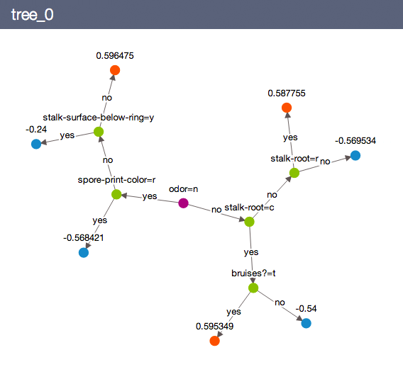

<script src="../turi/js/recview.js"></script>
# Decision Tree Classifier
 
A decision tree classifier is a simple machine learning model suitable for
getting started with classification tasks. Refer to the chapter on [decision
tree regression](decision_tree_regression.md) for background on decision trees.


##### Introductory Example

```python
import graphlab as gl

# Load the data
# The data can be downloaded using
data =  gl.SFrame.read_csv('http://s3.amazonaws.com/gl-testdata/xgboost/mushroom.csv')

# Label 'c' is edible
data['label'] = data['label'] == 'c'

# Make a train-test split
train_data, test_data = data.random_split(0.8)

# Create a model.
model = gl.decision_tree_classifier.create(train_data, target='label',
                                           max_iterations=2,
                                           max_depth = 3)

# Save predictions to an SArray. 
predictions = model.predict(test_data)

# Evaluate the model and save the results into a dictionary
results = model.evaluate(test_data)
```
We can visualize the models using

```python
model.show(view="Tree", tree_id=0)
model.show(view="Tree", tree_id=1)
```



##### Advanced Features

Refer to the earlier chapters for the following features:

* [Using categorical features](linear-regression.md#linregr-categorical-features)
* [Sparse features](linear-regression.md#linregr-sparse-features)
* [List features](linear-regression.md#linregr-list-features)
* [Evaluating Results](logistic-regression.md#logregr-evaluation)
* [Multiclass Classification](logistic-regression.md#logregr-multiclass)
* [Working with imbalanced data](logistic-regression.md#logregr-imbalaced-data)
